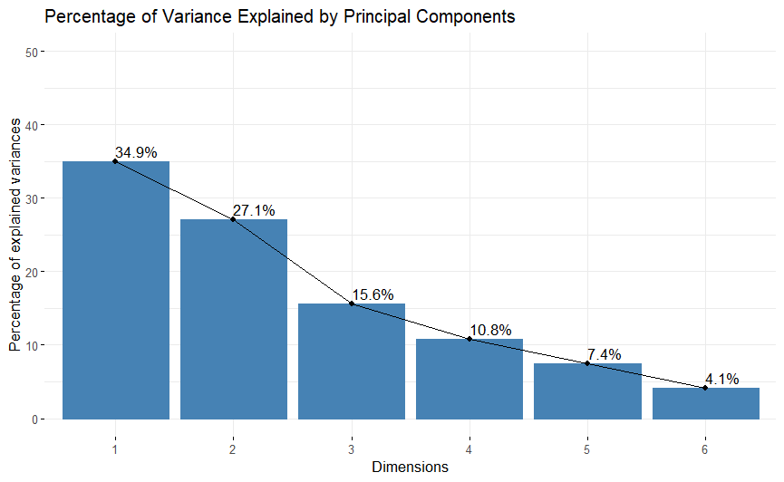
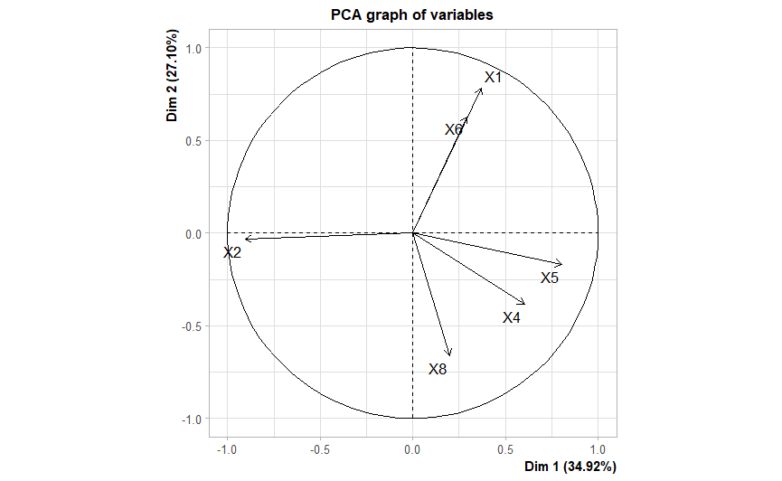
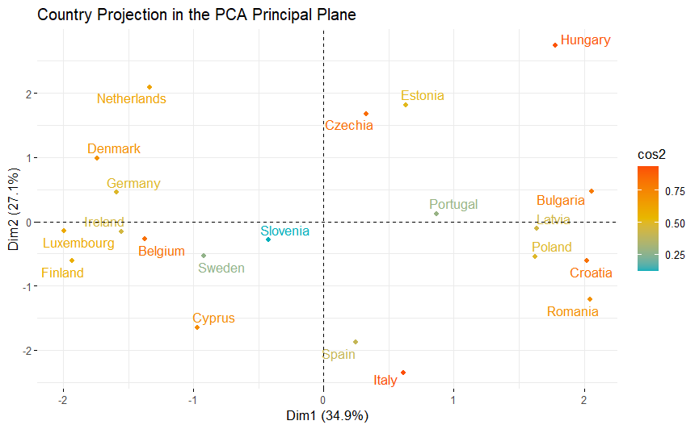
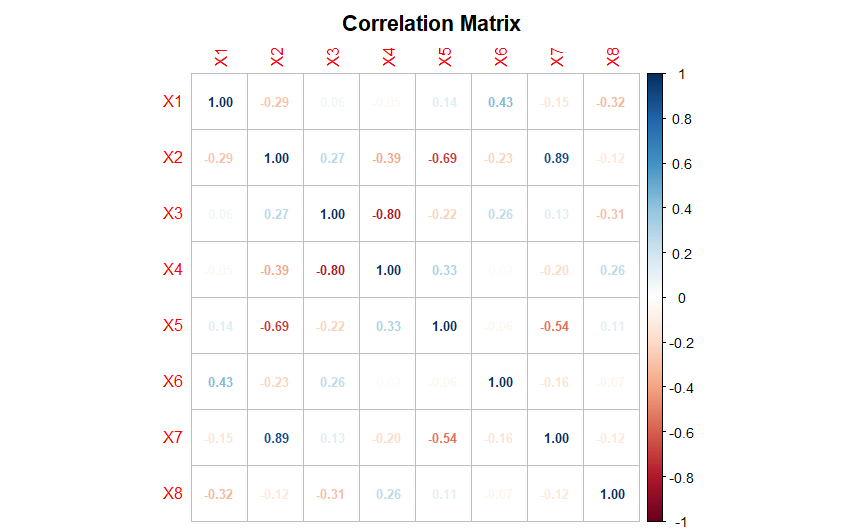
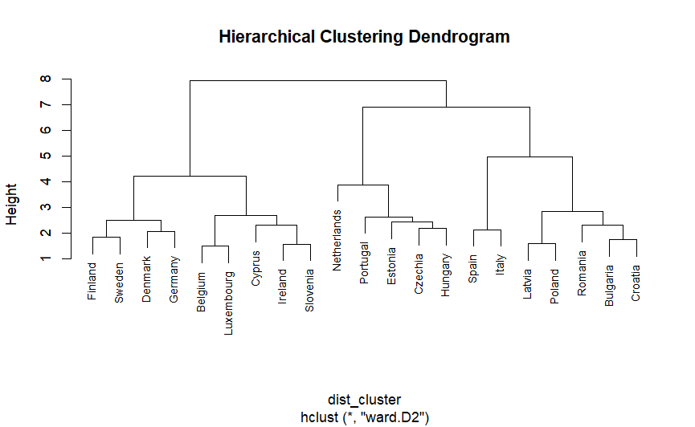
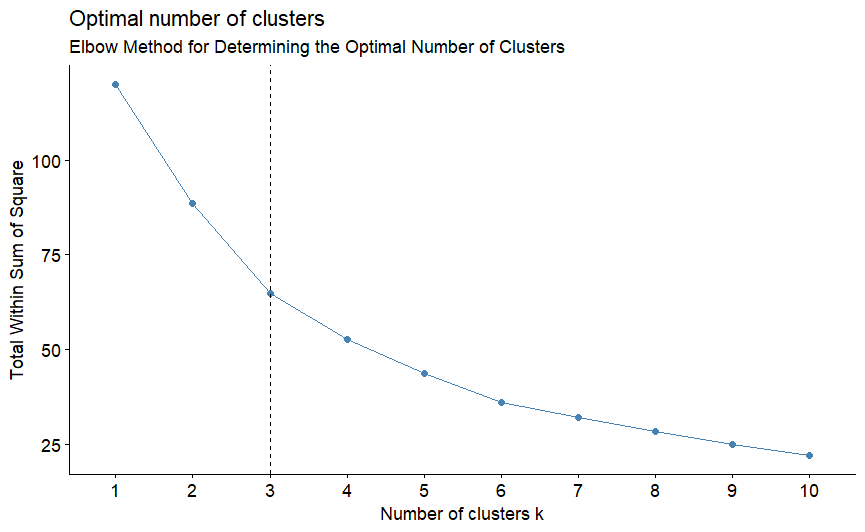
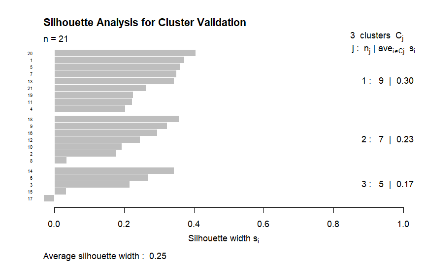
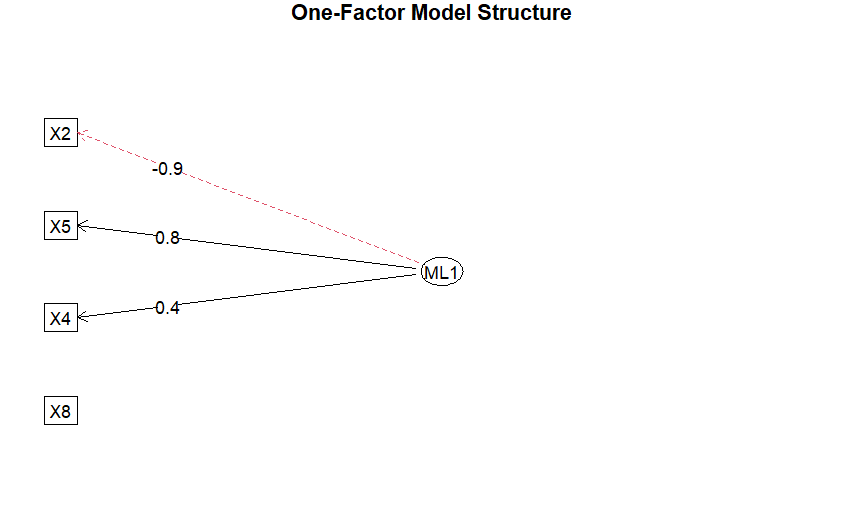

# Financial Behavior Analysis in the Romanian Real Estate Market

## Project Overview

This project explores financial behavior and housing accessibility patterns among young Romanian adults using multivariate statistical analysis techniques in R.

The analysis was conducted as part of a Master's dissertation in Cybernetics and Quantitative Economics and focuses on identifying relationships, latent structures, and country-level similarities through dimensionality reduction and clustering techniques.

---

## Objectives

- Analyze financial and housing-related indicators across multiple European countries
- Identify hidden relationships between socio-economic variables
- Reduce data dimensionality using Principal Component Analysis (PCA)
- Group countries with similar characteristics using Cluster Analysis
- Explore latent structures through Exploratory Factor Analysis (EFA)

---

## Tools & Technologies

- R
- RStudio
- ggplot2
- FactoMineR
- factoextra
- corrplot
- psych
- Cluster Analysis
- Principal Component Analysis (PCA)
- Exploratory Factor Analysis (EFA)

---

## Repository Structure

```text
data/               -> Dataset used for the analysis
scripts/            -> R analysis scripts
visualizations/     -> Generated charts and visual outputs
report/             -> Project summary and documentation
```
## Key Visualizations

### Scree Plot

Shows the percentage of variance explained by each principal component.



---

### PCA Variables Correlation Circle

Visual representation of variable contributions and correlations within the PCA space.



---

### Country Projection in PCA Space

Projection of analyzed countries in the PCA principal plane based on financial and housing indicators.



---

### Correlation Matrix

Correlation analysis of the selected socio-economic variables.



---

### Hierarchical Clustering Dendrogram

Cluster analysis used to identify similarities between countries.



---

### Elbow Method

Method used to determine the optimal number of clusters.



---

### Silhouette Analysis

Cluster validation technique used to evaluate clustering quality.



---

### One-Factor Model Structure

Visualization of the factor analysis structure.



---

## Key Findings

- Principal Component Analysis successfully reduced the dimensionality of the dataset while preserving most of the variance.
- Cluster Analysis identified groups of countries with similar financial and housing accessibility patterns.
- Factor Analysis highlighted latent relationships between socio-economic indicators.
- Significant differences were observed between Western and Eastern European countries regarding financial behavior and housing accessibility.

---

## Project Context

This project was developed independently as part of academic research within the Master's program in Cybernetics and Quantitative Economics.

The dataset includes public statistical indicators and was analyzed exclusively for educational and research purposes.
